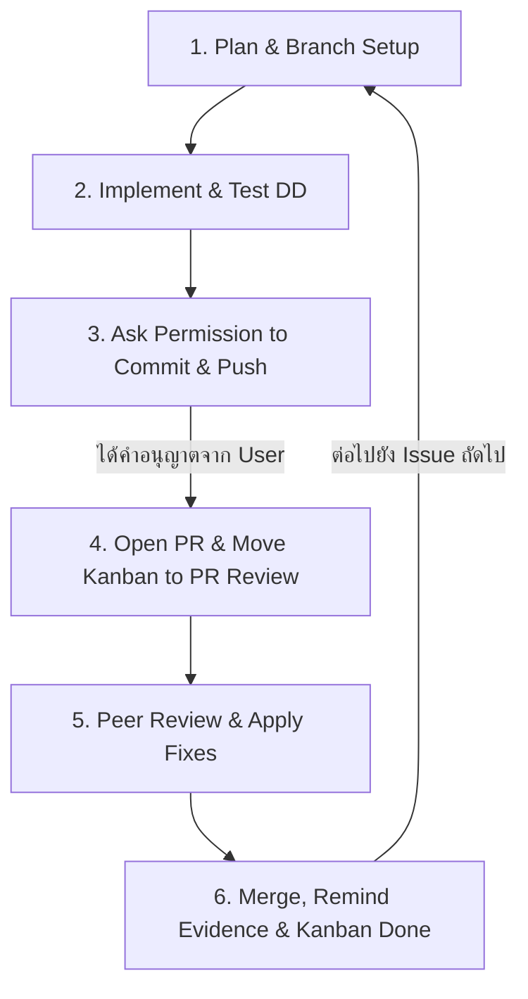

# TokTickIT — Engineering Development Workflow & Agent Instructions

เอกสารนี้คือ **Single Source of Truth** สำหรับแนวทางการพัฒนา, กฎเหล็ก (Strict Rules), ประวัติงานของวิชา Software Engineering (TokTickIT), และ **6-Step Core Development Loop** ที่ Antigravity / AI Assistant **ต้องปฏิบัติตามอย่างเคร่งครัดทุกครั้งและทุก Issue**

---

## 1. ข้อมูลภาพรวมโครงงาน & การเรียน (Course & Project Context)

- **วิชา:** Software Engineering (CPE / KMUTT)
- **ระบบที่พัฒนา:** **TokTickIT** — IT Support Ticketing Management System
- **Repository หลัก (ของฉัน):** `https://github.com/jiraphat-j/toktickit`
  - **Author:** นายจิรภัทร เจริญพิพัฒธาดา (Jiraphat Jarernpipattada) — 67070507217 — GitHub: [@jiraphat-j](https://github.com/jiraphat-j)
- **Repository คู่ตรวจ (Peer Reviewer / Partner):** `https://github.com/thanapornboont-star/toktickit`
  - **Partner:** นางสาวธนภรณ์ บุณฑริกมาศ (Thanaporn Boontrikamas) — 67070507204 — GitHub: [@thanapornboont-star](https://github.com/thanapornboont-star)
- **Base Branches ประจำแต่ละ Lab:**
  - `lab1-staging` ➔ รวมงาน Lab 1 ทั้งหมด (Merged to `main`)
  - `lab2-staging` ➔ รวมงาน Lab 2 ทั้งหมด (Merged to `main`)
  - `lab3-staging` ➔ รวมงาน Lab 3 ปัจจุบัน (Active Base Branch สำหรับเปิด PR)

---

## 2. ประวัติการพัฒนาและสิ่งที่ทำไปแล้ว (Course Progression)

### 📌 Lab 1 — Project Foundation & Diagnostic Infrastructure
- วางรากฐานโปรเจกต์ Fullstack: Node.js (Express + TypeScript) + React (Vite + TypeScript) + PostgreSQL (Prisma ORM)
- ระบบ Diagnostic Health Check API (`GET /api/health`), Categories API (`GET /api/categories`)
- ออกแบบ Design System และ Theme: **Zen Green Theme** (`zen-green.css`)
- จัดทำเอกสาร Engineering Blueprint และ Test Suite พื้นฐาน

### 📌 Lab 2 — Requester Operations & Ticketing Foundation
- **Dev Requester Context:** Mock/Dev Identity (`X-Dev-Requester-Id`), Requester Selection UI
- **Create Ticket:** ฟอร์มสร้างตั๋ว, Validation ฝั่ง Client & Server, Idempotency Protection (`Idempotency-Key` ป้องกันตั๋วซ้ำ)
- **Attachments Management:** Multi-upload ไฟล์แนบ (JPG, PNG, WEBP, PDF ขนาดไม่เกิน 5MB), Soft Delete, MIME validation
- **My Tickets List:** รายการตั๋วของผู้แจ้ง, ค้นหา (Search), กรอง (Category, Status, Priority), เรียงลำดับ (Sorting), แบ่งหน้า (Pagination)
- **Ticket Detail:** หน้าแสดงรายละเอียดตั๋วแบบ Read-Only, Preview & Download ไฟล์แนบ

### 📌 Lab 3 — Identity, Authentication, RBAC, IT Staff & Admin Governance (Active Sprint)
- **Issue #32 (PR #43):** Lab 3 Engineering Specification & API Contract (`docs/lab-03/*.md`)
- **Issue #33 (PR #44):** Test-Driven Development (Test DD) Blueprint & Traceability Matrix (`tests.md`, AC-01 ถึง AC-22)
- **Issue #34 (PR #45):** Database Migration — เปลี่ยนผ่านจาก DevRequester สู่โมเดล `User`, Enum `Role` (REQUESTER, IT_STAFF, ADMINISTRATOR), Session, Relations, และ Data Seeding
- **Issue #35 (PR #46):** Authentication, Session Management, First-Time Mandatory Password Change (`/api/auth/*`, HttpOnly Signed Cookies)
- **Issue #36 (Current):** Centralized RBAC Middleware (`requireRole`, `authenticateSessionOrDev`), Requester Ticket Isolation (404 Not Found ป้องกันข้อมูลรั่วไหล), Problem Appears Resolved Indicator Toggle, ปิดกั้น Internal Notes (403 Forbidden)
- **Upcoming Issues:**
  - Issue #37: IT Staff Ticket Queue & Advanced Filtering
  - Issue #38: IT Staff Ticket Detail, Claiming, Status Transition State Machine, Comments & Internal Notes
  - Issue #39: Administrator User Management & Safeguards (Deactivation lock, Last Admin protection)
  - Issue #40: Cross-feature UI Shell, Visual QA & Evidence Screenshots
  - Issue #41: E2E Scenarios (Playwright) & Full Regression Suite
  - Issue #42: Documentation Completion & Release PR to `main`

---

## 3. Strict 6-Step Core Development Loop (กฎเหล็กประจำขั้นตอน)

ทุกครั้งที่เริ่มทำ Issue หรือก้าวต่อไปในการพัฒนา **ต้องดำเนินตามลำดับ 6 ขั้นตอนต่อไปนี้ ห้ามข้ามขั้นตอนเด็ดขาด**:



### 🔹 Step 1: Plan & Branch Setup
1. สลับไปที่ base branch `lab3-staging` และ pull ข้อมูลล่าสุด:
   ```bash
   git checkout lab3-staging
   git pull origin lab3-staging
   ```
2. สร้าง Feature Branch ตามชื่อ Issue เช่น `feature/<issue-number>-<slug>`:
   ```bash
   git checkout -b feature/36-authorization-requester
   ```
3. ทบทวน Acceptance Criteria (AC), Business Rules (BR), และ Security Requirements ของ Issue
4. หากเป็นฟีเจอร์ขนาดใหญ่ ให้วาง Implementation Plan ก่อนเริ่มเขียนโค้ด

### 🔹 Step 2: Implement & Test (Test-Driven Development)
1. เขียนหรือปรับปรุง Automated Tests ก่อนหรือพร้อมกับโค้ด implementation:
   - Backend: `server/tests/lab-03/<test-file>.ts`
   - Frontend: `client/tests/lab-03/<test-file>.tsx`
2. พัฒนาโค้ดให้ครอบคลุม Requirements
3. **รัน Automated Tests ครบ 100% ทั้ง Server และ Client**:
   - `npm test` ในโฟลเดอร์ `server` (ต้องผ่านครบทุกชุด รวมทั้ง Regression ของ Lab 1 และ Lab 2)
   - `npm test` ในโฟลเดอร์ `client` (ต้องผ่านครบทุกชุด รวมทั้ง Regression)
4. **อัปเดตเอกสารคู่ขนานทันที**:
   - `docs/lab-03/tests.md`: เปลี่ยนสถานะจาก `Planned` ➔ `PASS` พร้อมระบุหลักฐาน
   - `docs/lab-03/reviewer.md`: เพิ่มหรืออัปเดตบันทึกของ Issue นั้นๆ ในส่วน Summary และ Detailed Log
   - `docs/lab-03/ai-use.md`: บันทึก Prompt และ Context การใช้งาน AI ตามข้อกำหนด

### 🔹 Step 3: Ask Permission to Commit & Push (🚨 STRICT RULE 🚨)
- **ห้าม `git commit` หรือ `git push` โดยพลการเด็ดขาด!**
- ต้องสรุปรายการไฟล์ที่แก้ไข, ผลการทดสอบ (Pass 100%), และ Proposed Commit Message (ตามรูปแบบ Conventional Commits เช่น `feat(rbac): ... (Issue #36)`) ให้ผู้ใช้ตรวจสอบ
- **หยุดรอคำตอบ (Stop & Wait) จนกว่าผู้ใช้จะพิมพ์อนุญาตอย่างชัดเจน** เช่น "commit เลย", "push ได้", "อนุมัติ"

### 🔹 Step 4: Open PR & Move Kanban to PR Review
1. เมื่อได้รับอนุญาต ให้ทำการ commit และ push:
   ```bash
   git add <files>
   git commit -m "feat(...): ... (Issue #<id>)"
   git push -u origin feature/<branch-name>
   ```
2. เปิด Pull Request ชี้เป้าหมายไปที่ branch `lab3-staging`
   - ชื่อ PR: `feat: ... (Issue #<id>)`
   - ใส่รายละเอียดความเชื่อมโยงกับ Issue (`Closes #<id>`), Summary of Changes, Test Results
3. นำลิงก์ PR ไปอัปเดตลงใน `docs/lab-03/reviewer.md` ในตารางสรุป PR
4. **แจ้งเตือนผู้ใช้ให้ย้ายการ์ดบน GitHub Kanban Project จาก `In Progress` ➔ `In Review / PR Review`**

### 🔹 Step 5: Peer Review & Apply from Comments (การ Review และประสานงานคู่ตรวจ)
1. แจ้งเตือนเพื่อนคู่ตรวจ (@thanapornboont-star) เข้ามาทำการ Review
2. เมื่อได้รับ Review Comment / Change Request จากเพื่อน:
   - ตรวจสอบประเด็นและดำเนินการแก้ไขโค้ด/เทสต์/เอกสารทันที
   - อัปเดตบันทึกใน `docs/lab-03/reviewer.md` (ระบุ Reviewer Comment, การแก้ไขที่ทำ, และ Commit Hash ที่แก้)
   - รันเทสต์ซ้ำเพื่อให้แน่ใจว่าไม่มี regression
   - ขออนุญาตผู้ใช้ Commit & Push commit แก้ไขขึ้น PR เดิม
   - แจ้ง Re-review จนกว่าจะได้รับการ **Approve**
3. **การ Review งานให้เพื่อน (Review Partner PRs):**
   - ตรวจสอบ PR ของเพื่อน (@thanapornboont-star) เรียงตามลำดับตัวเลข **เริ่มตั้งแต่ PR #50 เป็นต้นไป** (`#50`, `#51`, `#52`, `#53`, `#54`, ...):
     - URL รูปแบบ: `https://github.com/thanapornboont-star/toktickit/pull/<number>`
   - **หากตรวจสอบแล้วพบว่า URL ใดไม่พบ (404) หรือยังไม่เปิด PR ให้รีบแจ้งเตือนผู้ใช้ทันที**
   - เมื่อทำการ Review ให้เพื่อนแล้ว ให้นำข้อคิดเห็นและผลการ Approve ไปบันทึกลงใน Section 2 และ Section 4 ของ `docs/lab-03/reviewer.md` เสมอ

### 🔹 Step 6: Merge & Remind Evidence & Kanban
1. เมื่อเพื่อนทำการ Approve ให้เพื่อนเป็นผู้กด Merge PR เข้า `lab3-staging` (หรือกดยืนยันตามข้อตกลง)
2. สลับกลับมาที่ `lab3-staging` และ `git pull origin lab3-staging`
3. บันทึก Merge Commit Hash ลงใน `docs/lab-03/reviewer.md`
4. **แจ้งเตือนผู้ใช้:**
   - บันทึกหลักฐาน (Screenshot / Video / E2E test runs) ลงในโฟลเดอร์ส่งงาน
   - เลื่อนการ์ดบน GitHub Kanban Project จาก `In Review` ➔ `Done`
5. เตรียมความพร้อมและเข้าสู่ Step 1 ของ Issue ถัดไปตามแผน

---

## 4. Checklist & Quick Rules for AI Assistant

| กฎเหล็ก (Rule) | คำสั่งปฏิบัติการ (Action) |
|---|---|
| **ห้าม Commit เอง** | ต้องขอและได้รับอนุญาตจาก User ก่อนทุกครั้ง ไม่ว่าจะเป็น commit เล็กหรือใหญ่ |
| **Zero Regression** | ทุกครั้งที่ทำฟีเจอร์ใหม่ เทสต์เดิมของ Lab 1, Lab 2, และ Lab 3 ต้องยังคง Pass 100% |
| **Single Source of Truth** | Server Session Cookie คือตัวตนหลักตาม BR-24 (Dev Requester Selector ถูก Retire และคงไว้แค่ compatibility test) |
| **Security First** | ตั๋วคนอื่นต้องตอบ `404 Not Found` (ห้ามตอบ 403 เพื่อกัน user enumeration), Internal Notes ต้องตอบ `403 Forbidden` |
| **Docs Traceability** | อัปเดต `tests.md`, `reviewer.md`, `ai-use.md` เสมอ ห้ามทิ้งไว้ทำทีหลัง |
| **Partner Review Sync** | เช็ค PR เพื่อนเรียงเลขจาก #50 เรื่อยๆ ถ้าเจอ 404 ให้แจ้ง User ทันที |
| **Kanban Sync** | เตือน User ย้ายการ์ด Kanban (Todo ➔ In Progress ➔ PR Review ➔ Done) ทุกระยะ |

---
*ไฟล์นี้ถูกสร้างขึ้นเพื่อให้ AI Assistant และ Developer ยึดถือเป็นมาตรฐานสูงสุดในการร่วมพัฒนาโครงงาน TokTickIT ตลอดทุก Sprint*
